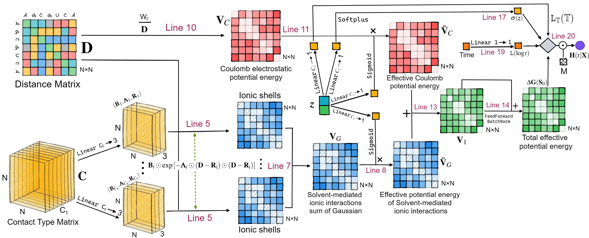

RNA-LifeTIme: A deep learning framework for RNA lifetime prediction.
===========
[](https://zhenghuazx.github.io/hua.zheng/)

**Cite us**: Hua Zheng, Wei Xie, Paul Whitford, Ailun Wang, Chunsheng Fang, Wandi Xu. (2023). _Structure-Function Dynamics Hybrid Modeling: RNA Degradation_. arXiv preprint arXiv:2305.03925.

vLab is a package for RNA lifetime prediction task written in pytorch. 

Predicting RNA degradation dynamics based on its 3D conformation remains a challenge due to the underdeveloped 
methodologies for modeling tertiary structure input. Current state-of-the-art RNA degradation predictive models 
primarily concentrate on primary and secondary structure information. Our paper provides a novel architecture for 
modeling the RNA unfolding process.


The lifetime of a native contact quantifies the importance of an individual inter-residue contact in the 
protein/RNA folding mechanism. We adopt this concept and apply it to RNA degradation process
(Figure above) by studying the trajectory of fraction of native contacts, i.e., the ratio of the number of 
contacts present in the current structure to the number of contacts in the native structure.


# Model Architecture


As the RNA molecule degrades, the fraction of native contacts reflects the percentage of the sequence that remains integrated.
The native conformation of the molecule is represented by the inter-residue distances and their contact types, i.e. 
$$\mathbf{X}\_0=(\mathbf{D}, \mathbf{C})$$
where 
* $\mathbf{D}$ : the $(i,j)$-entry of $\mathbf{D}$ represents the pair distance between 
residues $i$ and $j$ in the folded (native) state; 
* $\mathbf{C}$: the $(i,j, k)$-entry of the tensor $\mathbf{C}$ represents the $k$th type of contact between residues $i$ and $j$ in the folded (native) state. 

The input is the initial conformation of a RNA molecule and the environment condition, that is $\mathbf{S}_0 = (\mathbf{X}_0, \pmb{z})$. 
At any time $t$, the output of interest is the RNA lifetime probability (faction of native contacts) matrix $Q(t|\mathbf{X}\_0,\pmb{z}) $



RNA-LifeTime Model architecture: Arrows show the information flow among the various components described in this paper. 
Tensor shapes are shown with $N$ representing the number of residues, $C_t$ representing the number of types of native contacts, $C_g$ representing the number of Gaussians.

|       **undefined**        | **\# Parameters** | **MAE-LT**   | **MAE**        | **MSE**       | **Training Time**                  |
|:--------------------------:|:-----------------:|:------------:|:--------------:|:-------------:|:----------------------------------:|
|       **AFT-Linear**       | 295,627,971       | 262.7 (10.2) | 0.3744 (0.013) | 0.300 (0.012) | $\approx$ 1 day                    |
| **RNA-LifeTime ($C_g=1$)** | 42,246            | 67.84 (2.8)  | 0.1531 (0.003) | 0.106 (0.003) | $\approx$ 2 Hours                  |
| **RNA-LifeTime ($C_g=3$)** | 42,306            | 70.24 (2.2)  | 0.1461 (0.002) | 0.093 (0.002) | $\approx$ 3 Hours                  |
| **RNA-LifeTime ($C_g=5$)** | 42,366            | 67.44 (2.1)  | 0.1461 (0.002) | 0.090 (0.002) | $\approx$ 4 Hours                  |
|       **MD-Average**       | -                 | 52.5         | 0.1238         | 0.067         | $\approx$ 1 weeks (using 6-8 GPUs) |

The results in the table demonstrate that RNA-LifeTime achieved high accuracy in the lifetime probability prediction. Here the MD simulation is the ground true model. RNA-LifeTime performs better than AFT-Linear in terms of MAE-LT, MAE, and MSE, while having much fewer parameters and a shorter training time. This suggests that RNA-LifeTime is more efficient and accurate for predicting RNA degradation rate. Among the RNA-LifeTime models tested, the one with $C_g=5$ achieves the best performance, with an MAE-LT of 67.44 (2.1), a MAE of 0.1461 (0.002), and an MSE of 0.090 (0.002).
%in approximately 4 hours of training time. 

Furthermore, we compute the MAE-LT, MAE, and MSE for the mean trajectories of the MD simulation (MD-average) to represent the intrinsic randomness in the system (refer to the last row of the table). These results approximate the lowest achievable error. In comparison, the estimation errors of RNA-LifeTime are close to those of the MD-average, suggesting that RNA-LifeTime demonstrates a strong performance.

Installation
======================================
If you would like to build the library from the source code, then at the root `/RNA-LifeTime`, run
```shell
pip install build
python -m build
```
Then install RNA-LifeTime and clean up the directory
```shell
pip install dist/RNA_LifeTime-1.0.0-py3-none-any.whl
rm -r dist
```
Usage
======================================
### Usage Help
the main.py script provides useful help messages that describe the available command-line arguments and their usage.
```shell
python main.py --help
```
Read the help messages to check out hyperparamters:
```shell
usage: main.py [-h] [-e NUM_EPOCHS] [-b BATCH_SIZE] [--dtype DTYPE] [-lr LR] [-c CP_DIR] [-m MODEL_TYPE] [-p PATH] [-f PREPROCESSED] [-t TRUNCATED] [-g NUM_GAUSSIANS] [-l MAX_LENGTH] [-fh FEEDFORWARD_HIDDEN_MULTIPLIER] [-d DROPOUT] [-r SEED] [--log_interval LOGGING_INTERVAL]
               [--patience PATIENCE] [--step STEP_SIZE] [--gamma GAMMA]

optional arguments:
  -h, --help            show this help message and exit
  -e NUM_EPOCHS, --num-epochs NUM_EPOCHS
                        Number of epochs.
  -b BATCH_SIZE, --batch-size BATCH_SIZE
                        The batch size.
  --dtype DTYPE         Data type.
  -lr LR, --learning-rate LR
                        Learning rate
  -c CP_DIR, --checkpoint_dir CP_DIR
                        Whether to run on the real test set (if not included, the validation set is used).
  -g NUM_GAUSSIANS, --num_gau NUM_GAUSSIANS
                        Number of Gaussian used for modeling solvent-mediated interaction.
  -l MAX_LENGTH, --max_len MAX_LENGTH
                        Max sequence length. Shorter sequences are padded.
  -fh FEEDFORWARD_HIDDEN_MULTIPLIER, --ff_hidden_mult FEEDFORWARD_HIDDEN_MULTIPLIER
                        Scaling factor that determines the size of the hidden layers relative to the input layers.
  -d DROPOUT, --dropout DROPOUT
                        Dropout rate.
  -r SEED, --random-seed SEED
                        RNG seed. Negative for random
  --log_interval LOGGING_INTERVAL
                        Logging interval.
  --patience PATIENCE   Patience in early stopping.
  --step STEP_SIZE      Period of learning rate decay.
  --gamma GAMMA         Multiplicative factor of learning rate decay.
```

### Example
```python
python main.py -e 15 -b 512 -lr 0.003 -c ./MD-simulation/models/ -m RNA-LifeTime -p ./MD-simulation/ -f False -g 3 -l 72 -t False -d 0.2 -r 1 --step 3 --gamma 0.3
```


# Contact
If you have any questions, or just want to chat about using the package,
please feel free to contact me in the [Website](https://zhenghuazx.github.io/hua.zheng/).
For bug reports, feature requests, etc., please submit an issue to the email <zheng.hua1@northeastern.edu>.
